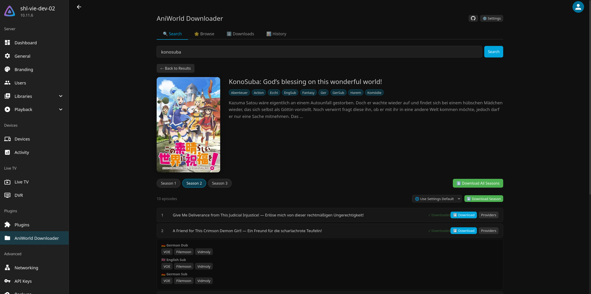

# Jellyfin AniWorld Downloader

A Jellyfin plugin for searching and downloading anime and series from [aniworld.to](https://aniworld.to) and [s.to](https://s.to), directly inside Jellyfin's web interface.

Series View |
:-------------------------:|
 |

## Features

- **Search and browse** anime and series with cover art, popular titles, and new releases
- **Download** individual episodes, full seasons, or entire series
- **Two sites supported**: aniworld.to (anime) and s.to (series), each with independent settings
- **Multiple languages**: German Dub, English Sub, German Sub
- **Multiple providers**: VOE, Filemoon, Vidoza and Vidmoly with automatic fallback
- **Download manager** with real-time progress, cancel, retry, and batch operations
- **Automatic retries** with exponential backoff and provider fallback
- **Auto library scan** so new episodes appear in Jellyfin immediately
- **Jellyfin-compatible naming**: `Series Name/Season 01/Series Name - S01E01 - Episode Title.mkv`

## Looking for more?

This plugin is a lightweight downloader built into Jellyfin for convenience. If you need a standalone tool with its own web UI, more configuration options, and additional features, check out [AniWorld-Downloader](https://github.com/phoenixthrush/AniWorld-Downloader) by phoenixthrush which I also actively maintain.

## Requirements

- Jellyfin **10.9.0** or newer
- **ffmpeg** (bundled with Jellyfin)

## Installation

### Plugin Repository (recommended)

1. In Jellyfin, go to **Dashboard > Plugins > Repositories**
2. Add a new repository with this URL:
   ```
   https://raw.githubusercontent.com/SiroxCW/Jellyfin-AniWorld-Downloader/main/manifest.json
   ```
4. Go to **Catalog**, find **AniWorld Downloader**, and click **Install**
5. Restart Jellyfin

*If the plugin does not show up in the Catalog, restarting Jellyfin made it appear.*

Updates will show up automatically in the plugin catalog.

### Manual Install

1. Download the latest `.zip` from [Releases](https://github.com/SiroxCW/Jellyfin-AniWorld-Downloader/releases)
2. Extract it to your Jellyfin plugins directory:
   ```
   /var/lib/jellyfin/plugins/AniWorldDownloader/
   ```
   The folder should contain `Jellyfin.Plugin.AniWorld.dll` and `meta.json`.
3. Restart Jellyfin

### Build from Source

Requires .NET 9.0 SDK.

```bash
cd Jellyfin.Plugin.AniWorld
dotnet build --configuration Release
```

Then copy the output:

```bash
mkdir -p /var/lib/jellyfin/plugins/AniWorldDownloader
cp bin/Release/net9.0/Jellyfin.Plugin.AniWorld.dll /var/lib/jellyfin/plugins/AniWorldDownloader/
cp meta.json /var/lib/jellyfin/plugins/AniWorldDownloader/
sudo systemctl restart jellyfin
```

## Configuration

After installing, go to **Dashboard > Plugins > AniWorld Downloader** to configure.

### General

| Setting | Description |
|---------|-------------|
| Max Concurrent Downloads | How many downloads run at the same time (default: 2) |
| Max Retry Attempts | How many times to retry a failed download before giving up (default: 3) |
| Auto-scan Library | Trigger a Jellyfin library scan when a download finishes |

### Per-site settings (aniworld.to / s.to)

Each site can be enabled or disabled independently and has its own settings. If a per-site setting is left empty, the global default is used.

| Setting | Description |
|---------|-------------|
| Enabled | Toggle this site on or off |
| Download Path | Where to save files (should point to a Jellyfin library folder) |
| Preferred Language | Default language for downloads |
| Preferred Provider | Default streaming provider |
| Fallback Provider | Backup provider if the primary one fails after all retries |

## Usage

1. Open **AniWorld Downloader** from the admin dashboard sidebar
2. Use **Search** to find a title, or browse **Popular** / **New Releases**
3. Click a title to see its seasons and episodes
4. Hit **Download** on an episode, or use **Download Season** / **Download All Seasons** for batch downloads
5. Switch to the **Downloads** tab to monitor progress
6. Check **History** for past downloads and stats

## How It Works

1. Searches use each site's AJAX search endpoint
2. Series, season, and episode pages are scraped to find provider links
3. Provider redirect URLs are resolved to embed pages
4. Each provider has a dedicated extractor that pulls out the direct stream URL
5. ffmpeg downloads the stream and saves it as MKV

### Supported providers

| Provider | Method |
|----------|--------|
| **VOE** | Decodes obfuscated JSON (ROT13, base64, char shift) to extract HLS URLs |
| **Filemoon** | Handles both modern Byse API (AES-256-GCM) and legacy packed JS |
| **Vidmoly** | Extracts HLS URLs from JavaScript sources |
| **Vidoza** | Extracts MP4 URLs from source tags |

## License

MIT
